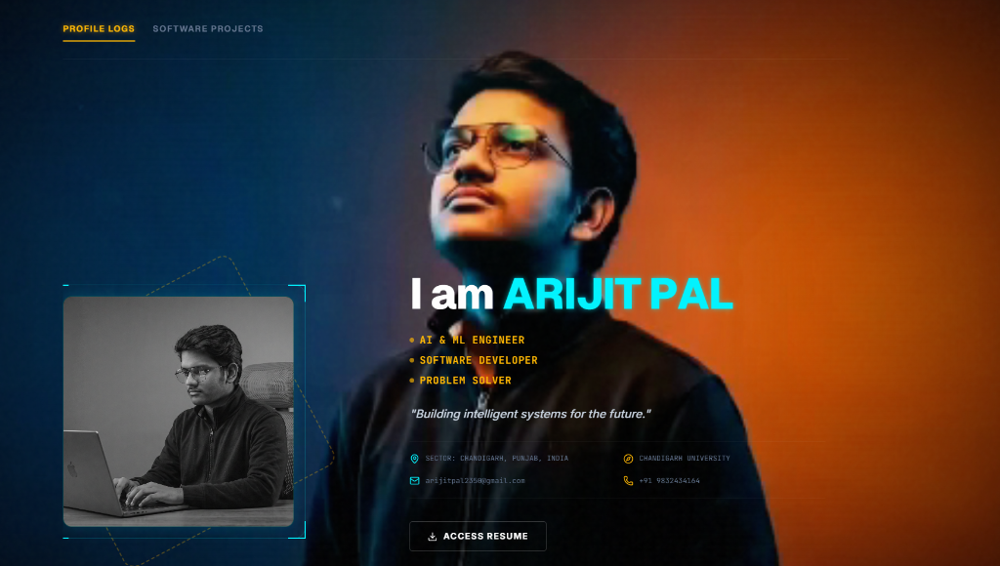

# Arijit Pal - Personal Portfolio

Welcome to my personal portfolio website, showcasing my work as an AI & ML Engineer, Software Developer, and Problem Solver.

## 📱 Preview

<div align="center">
  
</div>

---

## 🚀 Features

- **Profile Logs / About Me**: Details about my focus on building intelligent systems.
- **Software Projects**: Highlights of key projects and interactive games/demos.
- **Interactive Demos**: Built-in interactive components including Tic-Tac-Toe, Snake Game, and more.

---

## 🛠️ Tech Stack

- **Frontend**: React (v19), TypeScript, TailwindCSS
- **Animations**: Motion
- **Build Tool**: Vite
- **AI Integrations**: Gemini API (`@google/genai`)

---

## 💻 Run Locally

### Prerequisites
- Node.js installed on your machine.

### Installation

1. **Clone the repository:**
   ```bash
   git clone https://github.com/Arijit-Pal77/Portfolio.git
   cd Portfolio
   ```

2. **Install dependencies:**
   ```bash
   npm install
   ```

3. **Configure Environment Variables:**
   Create a `.env` file in the root directory and add your Gemini API Key:
   ```env
   GEMINI_API_KEY=your_gemini_api_key_here
   ```

4. **Start the development server:**
   ```bash
   npm run dev
   ```
   Open [http://localhost:3000](http://localhost:3000) in your browser to view the site.